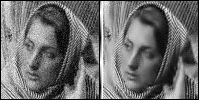

### **GAN-based-Novel-Single-Image-Denoising**

#### **Project Overview**
This project introduces a novel method for single image denoising using two Generators and one Discriminator model that cross-teach each other. The goal is to achieve high-quality denoised images without the need for ground truth data for training.

#### **Denoised Output**:

     
   The output shows a comparison between the original noisy image and the denoised image generated by the model.

#### **Key Features**:
- **Dual-Generator System**:
   - Two independent generators work together in a cooperative manner to denoise the input images.
- **Discriminator**:
   - A discriminator ensures the generated images are realistic and indistinguishable from clean images.
- **Ground Truth-Free Training**:
   - The model operates without requiring ground truth images for training, enabling it to learn purely from noisy inputs.
- **Results**:
   - The method achieves visually pleasing denoised images with a PSNR score improvement of 4.

#### **Design**:

**GAN Architecture:**
     
   This figure illustrates the dual generator and discriminator architecture used in the project.
